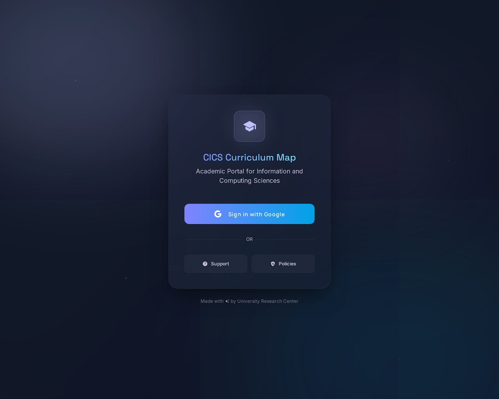
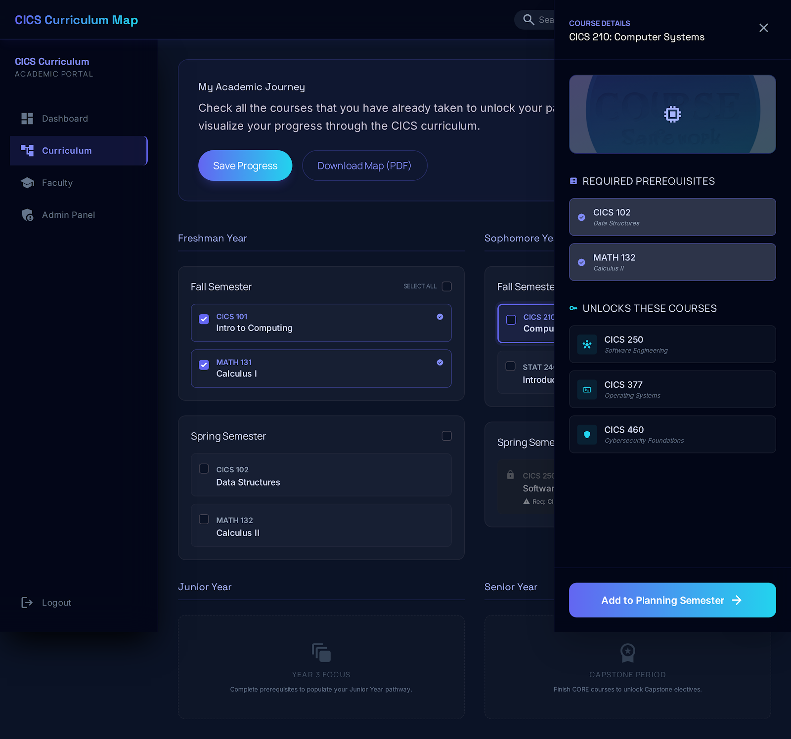
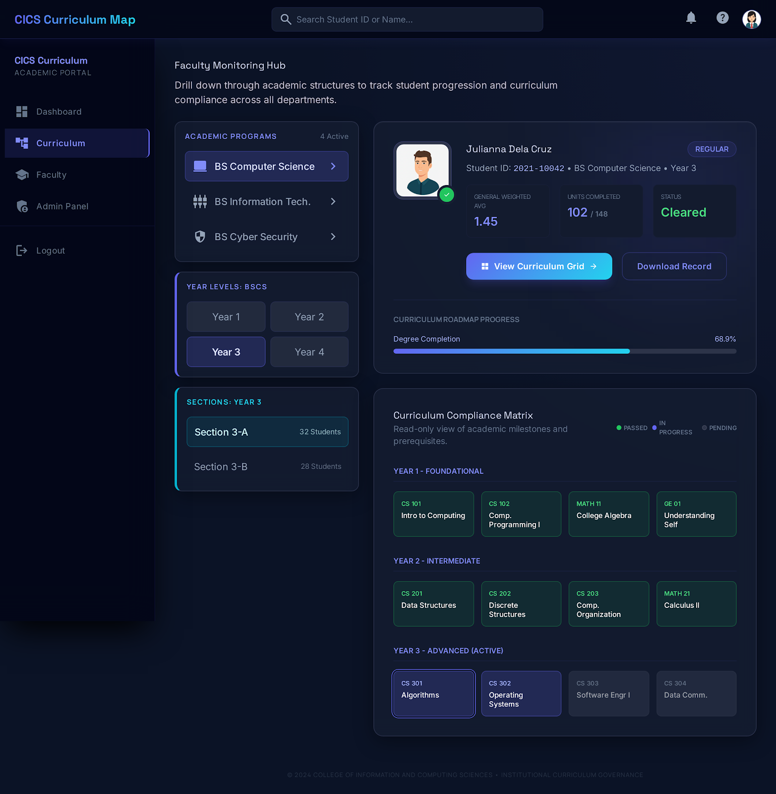
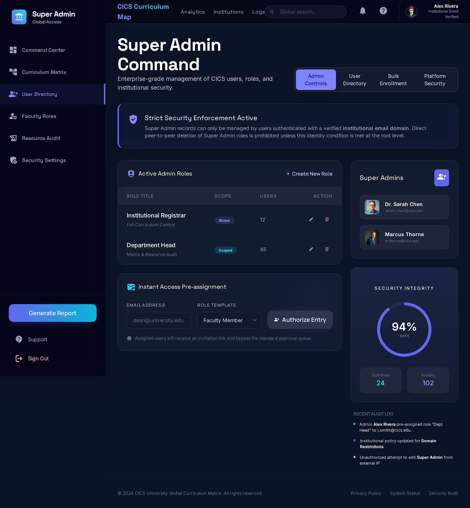

# CICS Curriculum Map - Stitch UI/UX Wireframes

This repository contains the definitive UI/UX wireframes for the **CICS Curriculum Map Academic Portal**. These designs utilize a "Cosmic" professional aesthetic, featuring glassmorphism and Tailwind CSS, tailored for university-level academic management.

## 📂 Folder Structure & Image Naming
Each module is organized into its own directory containing the source code (`code.html`) and the high-fidelity render (`screen.png`).

---

## 🎨 Wireframe Modules

### 1. Auth & Login
**Folder:** `cics_login_definitive/`  
**Stitch Prompt:** Create a clean, academic login page for a university portal. Center a login card on the screen. The card should have the university logo placeholder, a title "CICS Curriculum Map", and a prominent "Sign in with Google" button. Below the button, add a hidden error toast notification styled in red that says "You are not yet enrolled in any program." Use Tailwind CSS with a professional blue and white color scheme.

---

### 2. Student Dashboard
**Folder:** `student_dashboard_definitive/`  
**Stitch Prompt:** Design a responsive Student Curriculum Dashboard using Tailwind CSS. The layout should have a top navigation bar and a main content area. The main area displays a grid of academic years (Year 1 to Year 4), divided into two semesters each. Each semester is a container with a "Select All" checkbox in its header. Inside the semester, list course cards. Each course card has a checkbox, course code, and course title. Create a specific visual state for a "disabled/locked" course card. Include an interactive slide-over or modal that appears when a course is tapped, showing "Required Prerequisites" and "Unlocks These Courses" lists.

---

### 3. Faculty Dashboard
**Folder:** `faculty_hub_definitive/`  
**Stitch Prompt:** Create a Faculty Dashboard UI with Tailwind CSS. The left sidebar should have navigation. The main view displays a drill-down selection interface using large cards: first showing Programs (BSCS, BSIT, etc.). When a program is clicked, it reveals Year Levels, which then reveals Sections. Add a prominent search bar at the top to search for students by name or ID. Below the search, design a "Student Result" card that, when clicked, opens a read-only version of the Student Curriculum Grid.

---

### 4. Admin Management
**Folder:** `admin_management_definitive/`  
**Stitch Prompt:** Design an Admin Dashboard for user management using Tailwind CSS. Create a tabbed interface with two main tabs: "User List" and "Bulk Enrollment". The "User List" tab contains a data table with columns for ID, Name, Email, Role, and a "Soft Delete" toggle button. The "Bulk Enrollment" tab features a split layout. The top section has three dropdowns (Program, Year Level, Section). Below that is a dynamic data entry table with 5 rows by default, containing input fields for ID, Name, and Email, plus an "Add Row" button. Place a large "Confirm Enrollment" button at the bottom with a confirmation modal design.

---

### 5. Super Admin Dashboard
**Folder:** `super_admin_dashboard_definitive/`  
**Stitch Prompt:** Enterprise-grade management of CICS users, roles, and institutional security. Focus on high-level administrative controls, role assignment templates, and system-wide security integrity monitoring.

---

## 🛠️ Technical Stack
- **Styling:** Tailwind CSS
- **Fonts:** Space Grotesk (Headers), Inter (Body), Manrope (Labels)
- **Icons:** Material Symbols Outlined
- **UI Tool:** Stitch UI/UX

## 🚀 Usage
1. Navigate to any module folder.
2. Open `code.html` in your browser to view the interactive UI.
3. Refer to `screen.png` for the static design reference.

---
*Created by the University Research Center*