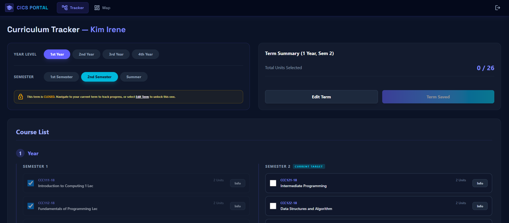
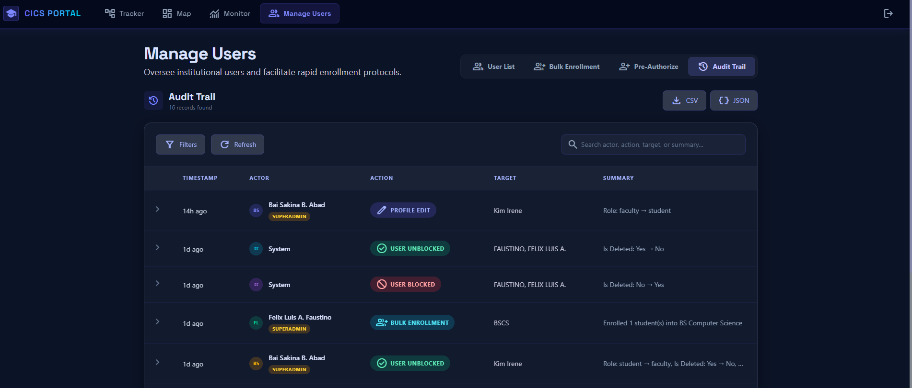

# Syllabus & Curriculum Map

[](https://opensource.org/licenses/MIT)
[](https://github.com/sponsors/JLNerecina)

## 1. Overview
The **Syllabus & Curriculum Map** is a specialized Knowledge Management system designed to streamline academic tracking. It enables students to visualize their degree progress, manages course prerequisites, and provides faculty/admins with powerful oversight tools. By transforming static syllabi into an interactive "map," it enhances knowledge retrieval and academic planning.

## 2. KM Framework
This project is built upon the **SECI Model** (Socialization, Externalization, Combination, Internalization):
* **Externalization:** Converting complex curriculum prerequisites into a visual, interactive map.
* **Combination:** Integrating Supabase-backed data (profiles, courses, audit logs) to provide a single source of truth.
* **Internalization:** Empowering students to understand their academic standing through automated tracking and progress reports.

## 3. Team
* **@[JLNerecina](https://github.com/JLNerecina)** – Lead / Scrum Master
* **@[BaiSakinaAbad](https://github.com/BaiSakinaAbad)** – QA & Documentation Lead
* **@[fausturnacht](https://github.com/fausturnacht)** – Full-stack Developer
* **@[engr-julia](https://github.com/engr-julia)** – UI/UX Designer
* **@[EranJosh](https://github.com/EranJosh)** – KM Analyst

## 4. Features
* **Authentication:** Google OAuth login via Supabase with role-based domain restriction.
* **Smart Mapping:** Interactive curriculum map showing course flows and prerequisite logic.
* **Academic Guardrails:** Automatic lockout of courses without prerequisites and overload warnings (>26 units).
* **Admin Suite:** Bulk enrollment, user status management (block/unblock), and faculty assignment.
* **Reporting:** Printable curriculum progress reports via `/map-print` and CSV Audit Trail exports.

## 5. Tech Stack
* **Frontend:** React 19, TypeScript, Vite 8
* **Styling:** Tailwind CSS 4 (Custom Theme Tokens), Material Symbols
* **Backend:** Supabase (Auth, Database, Edge Functions)
* **Testing:** Vitest, React Testing Library
* **Routing:** React Router DOM 7 (Protected Role-Based Routes)

## 6. Setup & Installation
1.  **Clone the Repo:**
    ```bash
    git clone https://github.com/JLNerecina/PE2-KM-Syllabus-Curriculum-Map.git
    cd PE2-KM-Syllabus-Curriculum-Map
    ```
2.  **Install Dependencies:**
    ```bash
    npm install
    ```
3.  **Environment Variables:** Create a `.env` file and add your Supabase credentials:
    ```env
    VITE_SUPABASE_URL=your_url
    VITE_SUPABASE_ANON_KEY=your_key
    ```
4.  **Run Development Server:**
    ```bash
    npm run dev
    ```

## 7. Repository Structure
```text
├── src/
│   ├── components/      # Reusable UI elements
│   ├── hooks/           # Custom React hooks (auth, database)
│   ├── pages/           # Route-based views (Map, Dashboard, Admin)
│   ├── lib/             # Supabase client & utility configs
│   ├── tests/           # Vitest suites
│   └── styles/          # Tailwind 4 configuration
├── supabase/            # Database schemas & migrations
└── public/              # Static assets
```

## 8. Branching Strategy
We follow a role-based feature branching strategy:
* **`main`**: Production-ready code only.
* **`dev`**: Integration branch for features.
* **`role/feature-name`**: (e.g., `qa/sprint1-tests` or `dev/auth-logic`).
* *Note: All PRs must target `dev` before being merged into `main`.*

## 9. Contribution Evidence
For a detailed log of all member contributions, linked PRs, and commit history, please visit our **[GitHub Wiki Contribution Log](https://github.com/JLNerecina/PE2-KM-Syllabus-Curriculum-Map/wiki/Contribution-Log)**.

---

## 10. Screenshots

*just a sample*


## 11. License & Academic Context
This project is licensed under the **MIT License**.
> This project is developed as a primary requirement for **PROFESSIONAL ELECTIVE 2 (PE2)** under the **Bachelor of Science in Computer Science (BSCS)** program at **NEW ERA UNIVERSITY**. 

---

## Support & Sponsorship
As an open-source academic project, we appreciate any support to keep the development and hosting running. 

### How to Sponsor
You can support our team through the following methods:
* **GitHub Sponsors:** Click the **"Sponsor"** button at the top of this repository.
* **Direct Support:** Contact the Project Lead [@JLNerecina](https://github.com/JLNerecina) for institutional partnerships or project inquiries.
* **Star the Repo:** If this project helped you, please give us a ⭐! It helps our visibility in the Open Source community.

---

