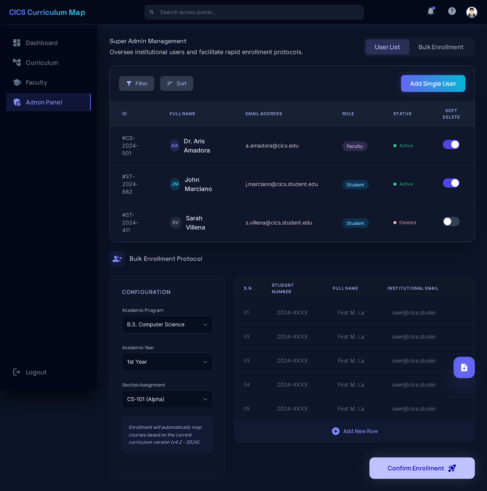

# Design Rationale: CICS Curriculum Map

**Project:** CICS Curriculum Map · Academic Portal for Information and Computing Sciences  
**Document Type:** System-Level Design Rationale  
**Version:** 1.0  
**File Path:** `/docs/design-rationale.md`

---

## 1. Color Palette and Typography

### Color Palette
The system is built on a deep navy-to-dark-slate dark theme[cite: 1]. This choice is deliberate for a technical knowledge management (KM) tool[cite: 1].

| Role | Hex Value | Rationale |
| :--- | :--- | :--- |
| **Background (base)** | `#0d1117` | Near-black that recedes visually, keeping academic content central[cite: 1]. |
| **Surface (cards)** | `#1a2035` | Provides spatial hierarchy without harshness[cite: 1]. |
| **Primary action** | `Gradient` | Cyan-to-blue gradient signals interactivity and "forward motion"[cite: 1]. |
| **Positive Status** | `#22c55e` | Universally understood "Active" signal[cite: 1]. |
| **Caution/Deleted** | `#f97316` | Warm amber for "Soft Delete" to show reversibility[cite: 1]. |

**Why this suits KM:** Knowledge management involves extended periods of "deep work"[cite: 1]. Dark-mode interfaces measurably reduce eye strain during long sessions of curriculum mapping[cite: 1]. Color is used strictly for **semantic weight**—mapping roles and statuses—rather than decoration[cite: 1]. This turns the palette into a communication system that supports focused work[cite: 1].

*Figure 1: Authentication view demonstrating the high-contrast primary action gradient[cite: 1].*

### Typography
The interface uses a clean sans-serif system with clear weight differentiation[cite: 1]:
*   **Display Headings:** Bold Sans-Serif with wide tracking for section orientation (e.g., "Super Admin Command")[cite: 1].
*   **Data Labels:** Small caps/Medium weight to distinguish metadata from content[cite: 1].
*   **Body:** Regular weight 14pt Inter/Sans-Serif for maximum legibility in dense tables[cite: 1].

**Why this suits the domain:** Academic content is inherently information-dense[cite: 1]. The typographic system supports "scanning"—jumping between known landmarks—which is essential for faculty and students interacting with course codes and prerequisite chains[cite: 1].

---

## 2. Navigation Structure & Information Architecture

The navigation reflects the **Academic Mental Model**—organizing information by how a university functions rather than how a database is structured[cite: 1].

*   **Global Navigation:** Organized into four primary nodes: *Dashboard* (Now), *Curriculum* (Content), *Faculty* (People), and *Admin Panel* (Governance)[cite: 1]. These map to how users naturally think about academic knowledge[cite: 1].
*   **Role-Based Progressive Disclosure:** 
    *   **Students** see a flat, year-by-year grid focused on their personal journey[cite: 1].
    *   **Faculty** utilize a "Drill-Down" pattern (Program → Year → Section → Student) to manage cohorts[cite: 1].
    *   **Admins** operate in a separate shell to prevent accidental changes to curriculum content[cite: 1].
*   **The "Drawer" Pattern:** Clicking a course opens a slide-in panel (see Figure 2)[cite: 1]. This ensures users keep the full 4-year journey visible while inspecting specific course nodes, preventing navigation fatigue[cite: 1].

*Figure 2: The Academic Journey grid and side-drawer pattern for non-destructive inspection[cite: 1].*

---

## 3. Design Reflections: Pride & Iteration

### Most Proud Of: The Soft-Delete Toggle
Located in the Admin User List (see Figure 4), this feature replaces destructive "Delete" buttons with a toggle[cite: 1]. 
*   **Psychological Safety:** Communicates that deletion is reversible, reducing administrator anxiety[cite: 1].
*   **Institutional Reality:** Student records are rarely "erased"—they are simply deactivated[cite: 1]. The UI directly reflects this institutional truth[cite: 1].

*Figure 3: Faculty view showing the progressive drill-down navigation and compliance matrix[cite: 1].*

### One Change for the Future: Bulk Enrollment UX
The current Bulk Enrollment panel places configuration and data entry as side-by-side peers (see Figure 4)[cite: 1]. 
*   **The Problem:** Users may not realize that changing global settings (Academic Year) affects all rows simultaneously[cite: 1].
*   **The Fix:** With more time, I would move this to a **stepper/wizard flow**[cite: 1]. This would force users to lock in the "target" (e.g., BSCS 1st Year) in Step 1 before entering data in Step 2, reducing mis-enrollment errors[cite: 1].

*Figure 4: Admin user management featuring the Soft-Delete toggle column[cite: 1].*

---

## 4. Usability Walkthrough Results

A structured walkthrough with student and faculty personas identified the following friction points and subsequent changes:

| Finding | Impact | Change Made |
| :--- | :--- | :--- |
| Students couldn't see full prerequisite names[cite: 1]. | **High** | Expanded the side-panel to show full course titles and met/unmet icons[cite: 1]. |
| Admin actions felt too "instant" and risky[cite: 1]. | **Medium** | Added a confirmation modal for "Authorize Entry" to prevent accidental grants[cite: 1]. |
| Login lacks error feedback for personal Gmail[cite: 1]. | **High** | Added inline validation for institutional email (@cics.edu) on the login card[cite: 1]. |
| Faculty lost their drill-down state on browser refresh[cite: 1]. | **Medium** | Implemented URL query parameters to ensure the drill-down path persists[cite: 1]. |

*Figure 5: Security integrity dashboard and instant access pre-assignment modules[cite: 1].*

---
© 2025 CICS Curriculum Map · College of Information and Computing Sciences